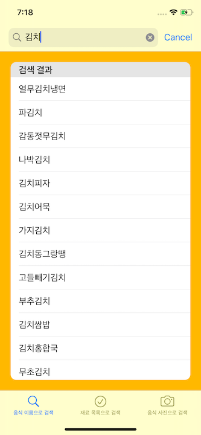
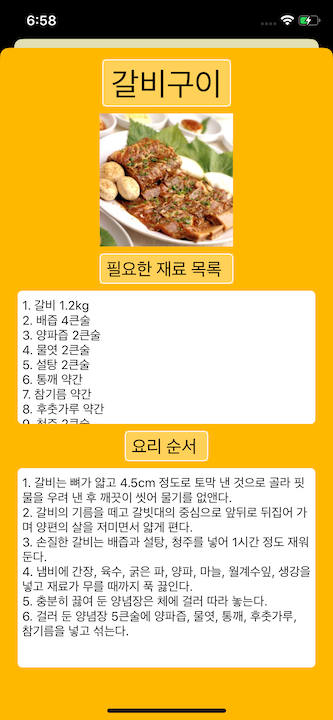

# Menu? Menu!
> 2020년 1학기 [경북대학교][knu] [컴퓨터학부][knucse] 모바일앱프로그래밍2 9팀 프로젝트입니다.

코로나 19로 인해 집에 있는 시간이 많아지면서 식사에 대한 고민도 많아졌습니다.  
농림수산식품교육문화정보원의 우리 농수산물 이용 레시피 공공데이터와 Teachable Machine을 활용해 레시피를 검색할 수 있는 앱을 제작했습니다.

## 사용 예제

  
음식 이름으로 검색 탭입니다.  

  
Search Bar를 사용해 특정 음식 검색도 가능합니다.  
  
  
재료 목록으로 검색 탭입니다.  
집에 있는 재료를 선택하고 검색 버튼을 누르면 해당 재료가 들어가는 음식 목록을 보여줍니다. 

  
음식 사진으로 검색 탭입니다.  
원하는 사진을 업로드 합니다.  

  
음식 인식하기 버튼을 클릭하면 AI를 사용해 사진을 분석합니다.  

  
분석 결과가 나오고 음식을 선택하면 세부 정보를 보여줍니다.  

  
음식을 선택하면 음식 대표 이미지, 필요한 재료 목록, 요리 순서 등 해당 음식에 대한 정보를 보여줍니다.  

## 개발 환경

* Xcode 11
* Swift 5

## 업데이트 내역

* 1.0.0  
  * 프로젝트 제출
* 0.3.0  
  * 음식 사진으로 검색 기능 추가
* 0.2.0  
  * 재료 선택해서 검색 기능
* 0.1.0
  * 음식 이름으로 검색 기능

## 정보

팀원 정보  
신주용 – [cheesecat47](https://github.com/cheesecat47) – cheesecat47@gmail.com  
한진규 - [jinkyuhan](https://github.com/jinkyuhan) – gkswlsrb95@gmail.com  
김성주 - [JIOMS](https://github.com/JIOMS) – kimsj4077@gmail.com  
갈리 바니 프리얀카 - [vanipriyanka99](https://github.com/cheesecat47) – gali.priyanka@btech.christuniversity.in  

[https://github.com/cheesecat47/MenuMenu](https://github.com/cheesecat47/MenuMenu)

[knu]: http://www.knu.ac.kr/
[knucse]: http://computer.knu.ac.kr/
